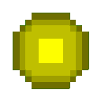

<a href="https://github.com/DandelionBold">
  <picture>
    <!-- Dark mode -->
    <source media="(prefers-color-scheme: dark)" srcset="images/banner/github-header-banner-dark.png" />
    <!-- Light mode -->
    <source media="(prefers-color-scheme: light)" srcset="images/banner/github-header-banner-white.png" />
    <!-- Fallback (shows in older browsers/renderers) -->
    
  </picture>
</a>
<!-- If you want the template Easy and fast to make, I generated it from https://leviarista.github.io/github-profile-header-generator/ -->

<!-- Centered Personal Info -->
<div align="center">

  <h1>🧑🏻‍💻 Software Engineer</h1>

  <p>
    📧 <a href="mailto:kamalnadykamal@gmail.com">kamalnadykamal@gmail.com</a> • 
    <a href="https://maps.app.goo.gl/Lkm91N7a41cyADre8"> </a>
    <a href="https://maps.app.goo.gl/Lkm91N7a41cyADre8">Alexandria, Egypt</a>
  </p>

  <!-- 👀 Profile Views -->
  <p>
    
    &nbsp;&nbsp;
    
    &nbsp;&nbsp;
    
  </p>

  <p>
    <a href="https://www.linkedin.com/in/kamal-nady"></a>&nbsp;
    <a href="https://raw.githubusercontent.com/DandelionBold/DandelionBold/main/gifs/Ok-and.jpeg"></a>&nbsp;
    <a href="https://github.com/DandelionBold"></a>
  </p>

</div>


<!-- GitHub Snake -->
<div align="center">
  <picture>
    <source media="(prefers-color-scheme: dark)" srcset="https://raw.githubusercontent.com/DandelionBold/DandelionBold/output/github-contribution-grid-snake-dark.svg">
    <source media="(prefers-color-scheme: light)" srcset="https://raw.githubusercontent.com/DandelionBold/DandelionBold/output/github-contribution-grid-snake.svg">
    
  </picture>
</div>

<!-- Centered heading -->
<h2 align="center"><a href="#-my-skills"></a> My Skills</h2>

<p align="center" style="color: gray; font-size: 0.9em;">
  🤓 I know it looks like a lot — but that's what happens when you're a fast learner with a programming obsession 💻⚙️🚀
</p>

| **Programming Languages** | **Frameworks** | **Libraries** | **Platforms** |
| :------------------------ | :------------- | :------------ | :------------ |
|            |      |        |        |

| **Databases** | **Markup** | **Styling** | **IDEs** |
| :------------ | :--------- | :---------- | :------- |
|       |     |          |                |

| **Tools** | **DevOps** | **Architecture** | **Design** |
| :--------| :----------| :---------------- | :--------- |
|            |  |     |   |

| **AI Agents** | **Browsers** | **Operating Systems** |
| :------------ | :----------- | :-------------------- |
| [](#) [](#) [](#) [](#) [](#) [](#) [](#) | [](#) [](#) [](#) [](#) [](#) [](#) | [](#) [](#) [](#) [](#) [](#) [](#) |

---

<!-- Image floats to the right -->
<a href="#-projects"></a>

<!-- Centered heading -->
<h2 align="center"><a href="#-projects"></a> Projects</h2>

<div align="center">
  <a href="#-projects"></a>
</div>

- 🧠 **CodeSpy (Graduation Project)** – LMS + Code Plagiarism Detection  
- 🏫 **Saint-Stephen School Management System**  
- 🤖 **Rubik’s Cube Solver Robot**  
- 🎮 **XO-playing Smart Robotic Arm**  
- 🧠 **GAN-based Face Generator**  
- 🏥 **Hospital Management System**  


<details closed>
<summary align="center"><h2><a href="#-all-projects-"></a> All Projects <a href="#-all-projects-"></a></h2></summary>

<div align="center">
  <a href="#-all-projects-"></a>
</div>

<!--
- **Project A** — one-liner value. Stack: <tech>. [Repo](#) • [Live](#)
- **Project B** — one-liner value. Stack: <tech>. [Repo](#) • [Demo GIF](#)
- **Project C** — one-liner value. Stack: <tech>. [Repo](#)
-->

### 🧠 CodeSpy (Graduation Project)
- **Description:** Full LMS with integrated **code-plagiarism detection** across **127 programming languages**, built to help instructors manage classes and uphold academic integrity.
- **Technologies:** HTML, CSS, JavaScript, **Python**, **Django**, **MySQL**
- **Features:**
  - Plagiarism detection with similarity analysis on code submissions.
  - Class/section management, assignments, grading, and progress tracking.
  - Teacher–student communication (announcements, messaging).
  - Role-based access (admins, teachers, students).
  - Integrity focus: nudges, guidance, and feedback to teach ethical coding.
- **Status:** Completed

---

### 🏫 Saint-Stephen School Management System
- **Description:** Management system for a church-service program (school-like) that teaches hymns, rituals, and Coptic language, with full attendance and materials tracking for students and teachers.
- **Technologies:** **Python**, **Django**, HTML, **SASS**, CSS, JavaScript, **MySQL**
- **Features:**
  - **Curriculum management** for church subjects (materials, units, attachments).
  - **Attendance tracking** for students and teachers.
  - **Roles & permissions:** teachers manage classes; students view grades, class details, and study materials.
  - Class announcements and simple teacher–student communication.
- **Notes:** Side project with evolving user requirements, so development spans longer and iterates with feedback.
- **Status:** In development

---

### 🤖 Robotic Rubik’s Cube Solver
- **Description:** End-to-end robot that detects cube colors, computes a valid solve sequence, and executes moves automatically.
- **Technologies:** **Python**, **OpenCV**, **Arduino UNO**
- **Features:** Color scanning & face detection (CV), move-planning, motor control, hardware + mechanical integration (incl. CNC considerations).
- **Timeline:** ~5 weeks alongside other coursework
- **Status:** Completed

---

### 🎮 XO-Playing Robotic Arm (Tic-Tac-Toe)
- **Description:** Vision-guided robotic arm that plays Tic-Tac-Toe against a human opponent.
- **Technologies:** **Python**, **OpenCV**, **Arduino UNO**
- **Features:** Board state detection with CV, game logic/AI for move selection, precise pick-and-place to grid cells, calibration/reset routines.
- **Status:** Completed

---

### 🧠 GAN-Based Face Generator
- **Description:** Generative Adversarial Network that synthesizes realistic human faces from a **seed**, producing **reproducible** outputs.
- **Technologies:** **Python**, **TensorFlow** (Deep Learning)
- **Features:**
  - Seed-based sampling (same seed ⇒ same face).
  - Latent-space exploration (vary the seed to generate diverse faces; interpolate between seeds).
  - Training/monitoring utilities and image exporters for result galleries.
- **Status:** Completed

---

### 💰 Customer Bank Simulation (Discrete-Event)
- **Description:** Bank operations simulator modeling customers moving through service points until exit.
- **Technologies:** **Python**, **SimPy**
- **Features:**
  - Agents for customers, queues, and tellers/service stations.
  - Metrics: avg. wait, queue length distributions, throughput, per-station **utilization**, SLA breaches.
  - Experiments: vary teller counts/service times to locate bottlenecks and recommend staffing.
  - Reports: per-station summaries and end-to-end time-in-system.
- **Status:** Completed

---

### 🏭 Factory Flow & Transport Simulation (Discrete-Event)
- **Description:** Production-line simulator for a **gears** factory. Loads move between machines with spacing constraints while **two trucks** shuttle items in sequence.
- **Technologies:** **Python**, **SimPy**
- **Features:**
  - Machine models with processing times/capacities and inter-machine distances.
  - Transporter logic for two trucks (dispatching, queues, route choice).
  - KPIs: machine utilization, WIP, transport idle time, cycle time, bottleneck detection.
  - Scenario testing (e.g., add a truck vs. rebalance machine times).
- **Status:** Completed

---

### 🏥 Hospital Management System
- **Description:** Desktop system covering core **clinical** and **administrative** workflows—not just basic CRUD.
- **Technologies:** **JavaFX**, **MySQL**
- **Features:**
  - **Appointments** (create, reschedule, cancel, clinician calendars).
  - **Medical records** (patient profiles, visit history, diagnoses, procedures).
  - Orders & documentation (prescriptions, labs/imaging requests).
  - Role-based access (admin/doctor/nurse/front-desk) and audit trails.
- **Status:** Completed

---

### 🩸 Blood Donation Matching App
- **Description:** Application that connects patients with suitable blood donors and enables direct coordination.
- **Technologies:** **Java**, **JavaFX**, multithreading
- **Features:**
  - **Matching by blood type** and **geographic proximity** (nearest suitable donors suggested).
  - In-app **chat** between donor and patient for coordination.
  - **Notifications** for new matches, message activity, and updates while waiting.
  - Built natively from scratch with concurrency for responsive UI and background matching.
- **Status:** Completed


<div align="center">
  <h2><a href="#-upcoming-projects"></a> Upcoming Projects</h2>
  <a href="#-upcoming-projects"></a>
  <br>
  <a href="#-all-projects-"></a>
  <p style="color: #888; font-style: italic; margin-top: 10px;">
    <a href="#-upcoming-projects"></a> More exciting projects coming soon...
  </p>
</div>

<hr>

</details>


<details closed>
<summary align="center"><h2><a href="#-experience---education"></a> Experience & <a href="#-experience---education"></a> Education</h2></summary>

<!-- Image floats to the right like coding animation -->
<a href="#-experience---education">
  
</a>

### 💼 Professional Experience

- ERP Systems & Enterprise Solutions
- Software Development & Database Management
- Cross-Platform Development
- Business Intelligence & Data Analytics
- Remote System Administration & Support
- Curriculum Development
- Technical Instruction
- Hands-on Training
- Student Mentorship

### 🎓 Academic Background

- **Major**: Computer Science
- **Minor**: Software Engineering

### 🏆 Achievements

- Competitive Programming Experience
- Continuous Learning & Fast Adaptation

</details>


<details open>
<summary align="center"><h2>📊 GitHub Stats & Activity</h2></summary>
  
<div align="center">
  
  <!-- Stats + Streak (side-by-side) -->
  <table>
    <tr>
      <td>
        <a href="#-github-stats--activity">
          <picture>
            <!-- Dark mode -->
            <source media="(prefers-color-scheme: dark)" srcset="https://github-readme-stats.vercel.app/api?username=DandelionBold&show_icons=true&hide_border=true&title_color=bc05ff&icon_color=1495ff&text_color=0CFFD2&bg_color=0c002e" />
            <!-- Light mode (your latest table) -->
            <source media="(prefers-color-scheme: light)" srcset="https://github-readme-stats.vercel.app/api?username=DandelionBold&show_icons=true&hide_border=true&bg_color=f6f8fa&title_color=bc05ff&text_color=10B981&icon_color=1495ff" />
            <!-- Fallback = dark mode -->
            
          </picture>
        </a>
      </td>
      <td>
        <a href="#-github-stats--activity">
          <picture>
            <!-- Dark mode -->
            <source media="(prefers-color-scheme: dark)" srcset="https://github-readme-streak-stats.herokuapp.com?user=DandelionBold&hide_border=true&ring=bc05ff&sideNums=bc05ff&stroke=1495ff&background=0c002e&sideLabels=0CFFD2&dates=1495ff&fire=1495ff&currStreakLabel=0CFFD2&currStreakNum=0CFFD2" />
            <!-- Light mode (your latest table) -->
            <source media="(prefers-color-scheme: light)" srcset="https://github-readme-streak-stats.herokuapp.com?user=DandelionBold&hide_border=true&background=f6f8fa&ring=bc05ff&sideNums=bc05ff&stroke=1f2328&sideLabels=10B981&dates=1495ff&fire=1495ff&currStreakLabel=10B981&currStreakNum=10B981" />
            <!-- Fallback = dark mode -->
            
          </picture>
        </a>
      </td>
    </tr>
  </table>


  <!-- Top Languages -->
  <!--
    Most Used Languages = based on file sizes.
    Top Languages by Repo = based on repo count.
  -->

  <a href="#-github-stats--activity">
    <picture>
      <!-- Dark mode -->
      <source media="(prefers-color-scheme: dark)" srcset="https://github-readme-stats.vercel.app/api/top-langs/?username=DandelionBold&layout=compact&hide_border=true&bg_color=0c002e&title_color=bc05ff&text_color=0CFFD2&icon_color=1495ff&langs_count=10" />
      <!-- Light mode (your latest table) -->
      <source media="(prefers-color-scheme: light)" srcset="https://github-readme-stats.vercel.app/api/top-langs/?username=DandelionBold&layout=compact&hide_border=true&bg_color=f6f8fa&title_color=bc05ff&text_color=10B981&icon_color=1495ff&langs_count=10" />
      <!-- Fallback = dark mode -->
      
    </picture>
  </a>

</div>
<hr>
</details>


<details open>
<summary align="center"><h2>📈 Contribution Graph (activity heatmap)</h2></summary>
  
<div align="center">
  <p align="center">
    <a href="#-contribution-graph-activity-heatmap">
      <picture>
        <!-- Dark mode -->
        <source media="(prefers-color-scheme: dark)" srcset="https://github-readme-activity-graph.vercel.app/graph?username=DandelionBold&bg_color=0c002e&color=0CFFD2&line=bc05ff&point=1495ff&area=true&hide_border=true" />
        <!-- Light mode (same scheme mapped) -->
        <source media="(prefers-color-scheme: light)" srcset="https://github-readme-activity-graph.vercel.app/graph?username=DandelionBold&bg_color=f6f8fa&color=10B981&line=bc05ff&point=1495ff&area=true&hide_border=true" />
        <!-- Fallback = dark mode -->
        
      </picture>
    </a>
  </p>
</div>
<hr>
</details>


<details open>
<summary align="center"><h2>🧾 Contribution Summary Cards</h2></summary>

<div align="center">
  <!-- Note: this generator doesn't accept per-color hex params; using closest theme -->
  
  <a href="#-contribution-summary-cards">
    <picture>
      <!-- Dark mode -->
      <source media="(prefers-color-scheme: dark)" srcset="https://github-profile-summary-cards.vercel.app/api/cards/profile-details?username=DandelionBold&theme=tokyonight" />
      <!-- Light mode (green/blue-friendly) -->
      <source media="(prefers-color-scheme: light)" srcset="https://github-profile-summary-cards.vercel.app/api/cards/profile-details?username=DandelionBold&theme=vue" />
      <!-- Fallback = dark mode -->
      
    </picture>
  </a>

  <a href="#-contribution-summary-cards">
    <picture>
      <source media="(prefers-color-scheme: dark)" srcset="https://github-profile-summary-cards.vercel.app/api/cards/stats?username=DandelionBold&theme=tokyonight" />
      <source media="(prefers-color-scheme: light)" srcset="https://github-profile-summary-cards.vercel.app/api/cards/stats?username=DandelionBold&theme=vue" />
      
    </picture>
  </a>

  <a href="#-contribution-summary-cards">
    <picture>
      <source media="(prefers-color-scheme: dark)" srcset="https://github-profile-summary-cards.vercel.app/api/cards/productive-time?username=DandelionBold&theme=tokyonight&utcOffset=8" />
      <source media="(prefers-color-scheme: light)" srcset="https://github-profile-summary-cards.vercel.app/api/cards/productive-time?username=DandelionBold&theme=vue&utcOffset=8" />
      
    </picture>
  </a>

  <a href="#-contribution-summary-cards">
    <picture>
      <source media="(prefers-color-scheme: dark)" srcset="https://github-profile-summary-cards.vercel.app/api/cards/repos-per-language?username=DandelionBold&theme=tokyonight" />
      <source media="(prefers-color-scheme: light)" srcset="https://github-profile-summary-cards.vercel.app/api/cards/repos-per-language?username=DandelionBold&theme=vue" />
      
    </picture>
  </a>

  <a href="#-contribution-summary-cards">
    <picture>
      <source media="(prefers-color-scheme: dark)" srcset="https://github-profile-summary-cards.vercel.app/api/cards/most-commit-language?username=DandelionBold&theme=tokyonight" />
      <source media="(prefers-color-scheme: light)" srcset="https://github-profile-summary-cards.vercel.app/api/cards/most-commit-language?username=DandelionBold&theme=vue" />
      
    </picture>
  </a>
</div>
<hr>
</details>


<details open>
<summary align="center"><h2><a href="#-github-trophies"></a> GitHub Trophies</h2></summary>
  
<div align="center">

  <!-- Note: trophies also doesn't support custom hex; 'dracula' is the closest look -->
  <!-- Light-mode pick = 'juicyfresh' (true light theme with green accents). 'algolia' is dark-toned, so it won't look light. -->
  <a href="#-github-trophies">
    <picture>
      <!-- Dark mode -->
      <source media="(prefers-color-scheme: dark)" srcset="https://github-profile-trophy.vercel.app/?username=DandelionBold&theme=dracula&margin-w=15&margin-h=15" />
      <!-- Light mode -->
      <source media="(prefers-color-scheme: light)" srcset="https://github-profile-trophy.vercel.app/?username=DandelionBold&theme=juicyfresh&margin-w=15&margin-h=15" />
      <!-- Fallback = dark mode -->
      
    </picture>
  </a>

</div>
<hr>
</details>


<details closed>
<summary align="center"><h2><a href="#-about-me-"></a> About me <a href="#-about-me-"></a></h2></summary>

<div align="center">
    <a href="#-about-me-"></a>
</div>

```python
from life import HardcoreMode
import os  # obviously secure, right? 😅
from dotenv import load_dotenv  # even more secure!

# Load the ultra-secret life credentials
load_dotenv()

class Life(Creativity):
    """
    A creative representation of my life profile.
    Everything here is driven by a programming obsession.
    """
    def __init__(self):
        # 🧍‍♂️ Personal Identity
        self.pronouns = "he/him"
        self.name = "Kamal Nady"
        self.locatedIn = "Alexandria, Egypt"
        self.job = "Software Engineer"
        self.education = "Bachelor of Computer Science, AAST (2019–2023)"
        self.company = "IronLabs"

        # Ultra-sensitive top-secret life password (shh 🤫)
        self.password = os.getenv("KAMAL_SUPER_SECRET_PASSWORD", "1234")  # default for me 😉

        # 🧠 Technical DNA
        self.skills = {
            "programmingLanguages": [
                "Java", "C#", "Python", "C", "C++", "PHP",
                "JavaScript", "Kotlin", "R", "Haskell", "MATLAB"
            ],
            "frameworks": [
                "Spring", "Flask", "Django", ".NET", "MAUI"
            ],
            "libraries": [
                "TensorFlow", "scikit-learn", "OpenCV", "THREE.JS", "OpenGL", "WEBGL", "DevExpress"
            ],
            "platforms": [
                "Android", "Arduino", "Linux", "WinForms", "WebAssembly", "Blazor"
            ],
            "databases": [
                "MySQL", "SQLite", "SQL Server", "MariaDB"
            ],
            "markup": [
                "HTML5", "XML", "JSON", "LaTeX"
            ],
            "styling": [
                "CSS", "Sass", "Tailwind", "Bootstrap", "Material Design",
                "Ant Design", "Syncfusion", "Radzen Blazor", "MudBlazor"
            ],
            "tools": [
                "Git", "Docker", "Nginx", "Postman", "Swagger",
                "Visual Studio", "VS Code", "Jupyter", "NetBeans", "JetBrains",
                "Android Studio", "GitHub"
            ],
            "devOps": [
                "DevOps"
            ]
        }

        # 🏛️ How my brain organizes code
        self.architecture = {
            "frontEnd": "Modern Web Interfaces",
            "backEnd": ["microservices", "monolithic"],
            "databases": ["Relational", "NoSQL", "In-memory"]
        }

        # 📜 The lore
        self.pastExperiences = [
            "IronLabs (2023–2024): Led development, maintenance, and ERP customization",
            "App Soft (2021–2022): Trained as a software developer in .NET MVC",
            "AAST Competitive Programming Contest (2020): Achieved 32nd place"
        ]

        # 🎯 What keeps me up at night (in a good way)
        self.fieldsOfInterests = [
            "Competitive Programming", "Software Architecture", "Machine Learning", "IoT", "Robotics"
        ]

        # 🧠 Where the knowledge lives
        self.technicalBackground = [
            "Bachelor in Computer Science with a minor in Software Engineering"
        ]


class GameEngine:
    """
    Emulator for free time (runs only when work process is suspended).
    """

    def __init__(self):
        self.saveFiles = {
            "Minecraft": {"mode": "Hardcore", "status": "Keep Inventory enabled 💀💩"},
            "Rocket League": {"rank": "Diamond", "status": "Chasing the ball instead of the rotation 🚗⚽"}
        }

    def start(self, game: str):
        if game in self.saveFiles:
            print(f"Booting {game}... Status: {self.saveFiles[game]['status']}")
        else:
            raise GameNotFoundError(f"{game} not installed!")

# Totally not running in production 😅
if __name__ == '__main__':
    profile = Life()
    print(f"Logging in with password: {profile.password} (definitely not hardcoded)")

    fun = GameEngine()
    fun.start("League Of Legends")
```

</details>

<hr>

<div align="center">
  <p align="center" id="-random-quote"><b>✨ Random Quote</b></p>
  <a href="#-random-quote">
    
  </a>
</div>


